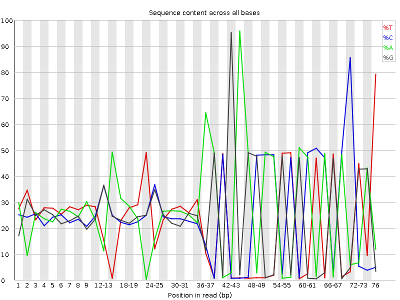
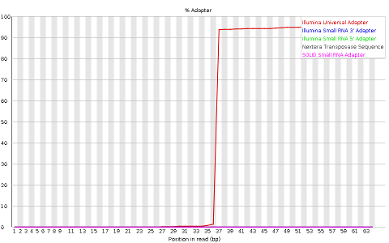

# ELB17S

## High Throughput Sequencing (HTS)

### Introduction

[Sanger sequencing](https://en.wikipedia.org/wiki/Sanger_sequencing) brought about a technological revolution, as it allowed to directly read DNA molecules with relative ease and affordability. The [Human Genome Project](https://en.wikipedia.org/wiki/Human_Genome_Project) motivated further progress, leading to automated DNA-sequencing machines capable of sequencing up to 384 samples in a single batch using capillary electrophoresis. 

At the moment, the high throughput sequencing technology most often used (by far) is Illumina. As with the Sanger method, it is also based on the addition of nucleotides specifically modified to block DNA strand elongation, where each nucleotide is marked with a different color. Though unlike the Sanger method, where a single DNA molecule is "read" at a time, modern illumina machines allow reading up to millions of DNA molecules simultaneously.  

The following links are a good source of information regarding this sequencing technology:
* [Illumina Sequencing by Synthesis](https://www.youtube.com/watch?&v=fCd6B5HRaZ8).
* [Elaine Mardis talk on NGS](https://www.youtube.com/watch?v=v1DbcJD4Ry0).

### The FastQ file format

Results of sanger sequencing are usually fasta files (obtained from processing chromatograms). Most high-throughput sequencing machines output [fastq files](https://en.wikipedia.org/wiki/FASTQ_format), the “de facto” current standard in HTS. Like fasta, fastq files are simply text files, but where each block of information (a sequenced DNA fragment, or read) in this format is encoded as 4 lines:

	@read_identifier
	read_sequence
	+ separator line
	base_qualities
	
For example, here you have 8 lines of a fastq file, corresponding to 2 sequences:

	@HWI-M01876:76:000000000-AF16W:1:1101:10853:1000 1:N:0:CGTGACAGAT
	NTGTACTTCATCCGAAACTCGTGCTCATCTCTGCTCAGATCGGAAGAGCACACGTCTGAACTCCAGTCACCGTGAT
	+
	#8ABCFGGGFCEDCFGGGGGGGFFCGEFGGGGGGFGGGGGGGGDEFGGGGGGGGGGGGGGGGGFFFEGGGGGGGGF
	@HWI-M01876:76:000000000-AF16W:1:1101:16471:1000 1:N:0:CGTGAACTTG
	NTTCCAGATATTCGATGCATGTGCCGCTCCTGTCGGAGATCGGAAGAGCACACGTCTGAACTCCAGTCACCGTGAT
	+
	#8BCCGGGGGGGGGGGGGGGGGGGGGGGGGGGGGGGGGGGGGGGEGGGGFGGGGGGGGGGGGGGGGGGGGGGGGGG

Each base has a quality character associated with it, representing how confidently the machine identified (called) the base. The probability of error per base is given as a [Phred score](https://en.wikipedia.org/wiki/Phred_quality_score), calculated from an integer value (Q) derived from the quality character associated to the base. Useful reference values of Q include:
* Q=10 - 90% accuracy
* Q=20 - 99% accuracy
* Q=30 - 99.9% accuracy
* Q=40 - 99.99% accuracy

Although there's theoretically no limit, Q usually goes up to around 40 in recent illumina machines.

To obtain this Q value from the character associated to the quality of the base, we have to know that each character (such as '#') has an [ASCII](https://en.wikipedia.org/wiki/Phred_quality_score) decimal value associated (for example, '#' has a value of 35). The Q value of a character is the decimal value corresponding to the entry of that character in the ASCII table, subtracted by 33. For example Q('#') = 35 – 33.

**NOTE**: To understand why we need to subtract 33, we have to look into the ASCII table below. We can see that the first visible character ('!') has decimal value 33. This allows visual inspection of qualities.

Looking at the first read of our fastq example, we can see it starts with 'N' (unknown), with an associated quality character '#'. To known how confident the machine was in reading that base, we calculate:
- Q = 35 (ASCII decimal value of '#') - 33 (ASCII decimal value of '!') = 2
- p(2) = 10-2/10 = 63% (probability of error)

Given this probability of error, it is not surprising that the machine could not confidently say which base was in that position, and therefore placed an 'N' in that position. It is fairly common that in the first bases the machine is still calibrating, and sometimes there is less confidence in the called base.

**TASK**: Calculate the probability of error of the bases of the following read in the fastq format:

	@SRR022885.1 BI:080102_SL-XAR_0001_FC201E9AAXX:6:1:752:593/1
	CGTACCAATTATTCAACGTCGCCAGTTGCTTCATGT
	+
	IIIIIIIIII>IIIIIII@IIII.I+I>35I0I&+/

**NOTE**: Turn on the green light when you're finished. Don't hesitate to ask questions and to turn on the red light if you're having issues.

**NOTE**: Phred+33 (Sanger fastq) is the current standard format. Nonetheless, with older illumina data (before 2009) preferred to start at the character '@' (ASCII: 64) instead of '!'. This Phred+64 format is the old illumina fastq. Some tools like FastQC can infer the format, while in others you need to specify.

### Quality Check of FastQ data

High Throughput Sequencing machines read thousands or millions of sequences in paralell. As you can imagine, this usually generates large fastq files, with millions of lines. Manually inspecting the quality of each read is out of the question. Specialized software has been developed to provide quality measures for fastq files generated by HTS machines. [FastQC](http://www.bioinformatics.babraham.ac.uk/projects/fastqc/) is a popular program to generate quality reports on fastq data. In fact, this is usually the first thing you should do once you receive a new dataset. FastQC reports provide a series of plots that allow the user to assess the overall quality of their raw data and detect potential biases and problems. 

Some plots indicate distribution of base qualities along the length of reads. At least for illumina data, on average the quality of each base tends to decrease along the length of the read. 

 

Other plots indicate biases in nucleotidic content of reads, either globally (as %GC plots), or positionally. Global bias in nucleotidic content can be useful to search for signs of contaminants. On the other hand, positional bias are useful to detect presence of artefactual sequences in your reads such as adaptors. Another insight you may obtain from this information are potential biases in the preparation of your library. For example, random hexamer priming is actually not truly random, and preferentially selects certain sequences. The currently popular transposase-based enzymatic protocol, although reasonably random, is also not completely random, and you can see this through positional bias, particularly in the beginning of reads. The presence of adaptors is a relatively common event, and therefore specific plots exist to detect the presence of the most commonly used adaptors. Finally, the presence of repetitive sequences can also suggest contaminants, pcr artifacts, or other types of bias.

 

**NOTE**: Given the size of fastq files (usually in the order of Gb), they are most frequently compressed as fastq.gz files. In fact, most tools (such as FastQC) work directly with fastq.gz to reduce space.

**NOTE**: Some technologies (such as Illumina) allow reading a fragment from both ends. This so called paired-end data (compared to single-end) generates two synchronized fastq files, where each line on one file has a corresponding line on the other file for the same fragment (from the opposite end). In this case, the reverse read (R2) is usually of worse quality than the forward read (R1).

**Task**: Open a terminal. type 'fastqc' and press enter. The graphical interface of FastQC should appear. Open the file MiSeq_76bp.fastq.gz inside of the folder fastq_examples. Look at the different plots you obtained. Next, open the file MiSeq_250bp.fastq.gz. Press the green button when you ran FastQC on both cases.

**Task**: In a terminal window, go to the folder fastq_examples. Type 'fastqc *.fastq.gz' and press enter. What did you obtain? Inspect all files and compare the different technologies. Illumina machines generate shorter reads, usually all with the same length. Pacbio and nanopore generate (much) longer reads, with diverse read lengths, and of a poorer quality. Illumina generates many more reads, making both technologies complementary to each other (this will become clearer when we look at specific applications). Finally, you can also notice that, independently of the technology, the quality of base quality tends to decrease along the length of the read.

### Filtering and Trimming

As you may have noticed before, reads tend to lose quality towards their end, where there is a higher probability of erroneous bases being called. To avoid problems in subsequent analysis, you should remove bases with higher probability of error, usually by trimming poor quality bases from the end.

**TASK**: Manually remove the bases with Q<30 from the 3' end of the read you analysed before. Press Green when finished.

	@SRR022885.1 BI:080102_SL-XAR_0001_FC201E9AAXX:6:1:752:593/1
	CGTACCAATTATTCAACGTCGCCAGTTGCTTCATGT
	+
	IIIIIIIIII>IIIIIII@IIII.I+I>35I0I&+/

**Questions**: Does this remove all lower quality bases from the read? What reasons you can think may cause this? What other strategies you can imagine to filter your reads? Can you remove bases in the middle of reads? Why?
	
Like you have FastQC to automatically produce plots from fastq files, you also have software to filter low quality bases from fastq files. [Seqtk](https://github.com/lh3/seqtk) is a very simple tool that you can use to perform this filtering. 

**TASK**: In a terminal, go to folder fastq_examples. Type 'seqtk trimfq -q 0.01 MiSeq_250bp.fastq.gz > MiSeq_250bp.trimmed.fastq'. What is this command doing? Use fastQC to check the new fastq file that is created by this command. Press green when finished.

Most software for the analysis of HTS data is freely available to users. Nonetheless, they often require the use of the command line in a Unix-like environment (seqtk is one such case). User-friendly desktop software such as [CLC](https://www.qiagenbioinformatics.com/products/clc-genomics-workbench/) or [Ugene](http://ugene.net/) is available, but given the quick pace of developmpent in this area, they are constantly outdated. Moreover, even with better algorithms, HTS analysis must often be run in external servers due to the heavy computational requirements. One popular tool is [Galaxy](https://galaxyproject.org/), which allows even non-expert users to execute many different HTS analysis programs through a simple web interface.

**TASK**: In the web browser of the workstation you're using, open 'localhost'. You should see the Galaxy interface. Upload into Galaxy the files MiSeq_76bp.fastq.gz and MiSeq_250bp.fastq.gz (you should now see them on your history in the right panel). Run fastqc (by searching for this tool on the left panel) in both files. In galaxy again, run seqtk on the file MiSeq_250bp.fastq.gz with the same parameters as you used in the command line. 

As we saw before, sequencing machines (namely, the illumina ones) require that you add specific sequences (adaptors) to your DNA so that it can be sequenced. For many different reasons, such sequences may end up in your read, and you need to remove these artifacts from your sequences.

**Question**: Can you think of a reason why the adaptors can appear in your sequences? Take the sample MiSeq_76bp.fastq.gz as an example.

There are many programs to remove adaptors from your sequences, such as [cutadapt](https://cutadapt.readthedocs.org/en/stable/). To use them you need to know the adaptors that were used in your library preparation (eg. Illumina TruSeq). For this you need to ask the sequencing center that generated your data.

**TASK**: In Galaxy, use cutadapt to remove adaptors from MiSeq_76bp.fastq.gz. In this sample, we know that we used the illumina adaptor GTGACTGGAGTTCAGACGTGTGCTCTTCCGATCT, so try to remove this from the 3' end of reads and see the impact of the procedure using FastQC. What happened? Almost no read was affected. This is because what you get is a readthrough, so you actually have the reverse complement of the adaptor. Now, try the same procedure but with AGATCGGAAGAGCACACGTCTGAACTCCAGTCAC (reverse complement of the previous). Much better, no? Press green when you've completed the task.

[Trimmomatic](http://www.usadellab.org/cms/?page=trimmomatic) is a tool that performs both trimming of low quality reads, as well as adaptor removal. Moreover, it already contains a library of commonly used adaptors, so you don't need to know their sequence. As FastQC, it is a java program, so you can use it in any operating system (such as Windows and Mac), although unlike FastQC it needs to be run only using the commandline. 

**TASK**: In Galaxy, use Trimmomatic to remove low quality bases from MiSeq_250bp.fastq.gz, as well as the remainings of illumina Nextera adaptors that are still left in some of the reads (for this you need to select to perform an initial Illumina clip). Press green when you've completed the task.

**Question**: What if you want to perform filtering and trimming on paired reads? Do you see a potential issue? What do these programs need to take into accout when dealing with paired data? 

## Applications of HTS

### Genomics - Resequencing

One of the most common applications of NGS is resequencing, where we want to genotype an individual from a species whose genome has already been assembled (a reference genome), such as the human genome, often with the goal to identify mutations that can explain a phenotype of interest.

#### Alignment to a reference genome

After obtaining millions of short reads, we need to align them to a (sometimes large) reference genome. To achieve this, novel, more efficient, alignment methods had to be developed. One popular method is based on the [burrows-wheeler transform](https://en.wikipedia.org/wiki/Burrows%E2%80%93Wheeler_transform) and the use of efficient data structures, of which [bwa](http://bio-bwa.sourceforge.net/) and [bowtie](http://bowtie-bio.sourceforge.net/index.shtml) are examples. They enable alignment of millions of reads in a few minutes, even in a laptop.

**NOTE:** Aligners based on the burrows-wheeler transform makes some assumptions to speed up the alignment process. Namely, they require the reference genome to be very similar to your sequenced DNA (less than 2-5% differences). Moreover, they are not optimal, and therefore sometimes make some mistakes.

To store millions of alignments, researchers also had to develop new, more practical formats. The [Sequence Alignment/Map (SAM) format](https://samtools.github.io/hts-specs/SAMv1.pdf) is a tabular text file format, where each line contains information for one alignment. SAM files are most often compressed as BAM (Binary SAM) files, to reduce space and allow direct access to alignments in any arbitrary region of the genome. Several tools
only work with BAM files.

TASK: Look at Anc_bwa_merged_select.sam and Anc_paired_ssaha2_select.sam. Also briefly look at SAMv1.pdf describing the format to understand the information in the sam files.

After generating alignments and obtaining a SAM/BAM file, how do I know this step went well? The same way as FastQC generates reports of fastq files to assess quality of raw data, there are programs that generate global reports on the quality of alignments. One popular tool for this is [qualimap](http://qualimap.bioinfo.cipf.es/).

#### Alignment to a reference genome

TASK: Look at a few premade qualimap reports on real alignment datasets
- Look at the sequence coverage graphs in: example_BGI_dup and example_BGI_Truseq
- Look at insert sizes in: example_BGI_Truseq and example_MiSeq
- Discuss duplication levels in: example_BGI_dup and HeLa_ChipSeq
NOTE: The way you check if the alignment step went well depends on your application. Usually,
duplication levels higher than 20% are not a good sign (they're a sign of low input DNA and PCR
artifacts) but again, depends on what you are sequencing and how much. Similarly, in the case of
bacterial sequencing or targeted (eg. exonic) sequencing you expect >95% successful alignment, but if
sequencing a full mamallian genome (with many duplicated areas) it may be normal to have as low as
70-80% alignment success. If you have to check the expected “quality” for your application.
TASK: (optional) Just to see how to use qualimap, run Qualimap with example bam files:
Anc_bwa_merged_select.bam; Anc_paired_ssaha2_select.bam; note that since these are very small
files the generated reports will have little useful information.

Detecting genetic variants
After aligning reads against a reference genome, you can now indicate where and how the individual(s)
genetic sequence differs from the reference genome. To do this, there are specialized tools such as
GATK13, freebayes and others that perform genotype attribution and detection of genetic variants from
SAM/BAM alignment files.
Single nucleotide polymorphisms (SNP) are the variants that are most easily and commonly reported.
Other variants pose different challenges and some are particularly difficult, such as the detection of
transposable element activity. Breseq14 is a software specialized in detecting several types of genomic
events in short timescale evolutionary experiments in bacteria. It produces user-friendly variant reports,
including the functional annotation of variants that have been detected. This means it can predict not
only which variants there are and where they are, but also their potential effects (in which genes, if they
fall in a coding region, etc...).
TASK: Open an example output file from breseq (index.html). Look at different types of genetic
variants and the different types of evidence that breseq uses to infer those variants.
The current standard for reporting genetic variants is the variat call format (VCF15), which is a text
based, where each line contains information about one putative variant detected by the software.

TASK: Open an example vcf file.
After inferring variants, functional annotation of variants is usually performed by specialized tools such
as the Variant Effect Predictor (VEP16) that take into account information on the reference genome.
13 https://www.broadinstitute.org/gatk/
14 http://barricklab.org/twiki/bin/view/Lab/ToolsBacterialGenomeResequencing
15 https://samtools.github.io/hts-specs/ VCF v4.2.pdf
16 http://www.ensembl.org/info/docs/tools/vep/index.html

Visualizing your results
After finishing your analysis, even if you did all the quality checks, and obtained a list of variants, you
may want to manually inspect your alignments (you should always manually inspect the regions that
are most important for your analysis). For this, there is simple desktop software that you can use to
visualize your data, such as IGV17 or Tablet18.
TASK: Run IGV and look at sample BAM files with alignments
First you'll need a reference genome:
– Open genome file genome ecoli_NC012759.1_bw2952.fa
Next open your alignment files:
– Anc_bwa_merged_select.bam
This file was aligned as single-end information, and accepting multiple mappings
– Anc_paired_ssaha2_select.bam
This file was aligned using paired-end data and ignoring multiple mappings
Look at the following regions:
– Mutation in the interval 784621-784665 in both datasets.
– Region 1357840-1360767
what do you think may happen when assembling an area like this?
Inspect the pairing information (need to set option on IGV to look at it)
NOTE: next to .bam files there is a .bai file with the same name. The .bai file is called the BAM index
file and it is used to enable tools such as IGV to navigate the alignments much faster (imagine if you
needed to go through millions of alignments every time you moved around in the genome).
NOTE: Most genomes (particularly mamallian genomes) contain areas of low complexity, composed
mostly of repetitive sequences. In the case of short reads, sometimes these align to multiple regions in
the genome equally well, making it impossible to know where the fragment came from. Longer reads
are needed to overcome these difficulties, or in the absence of these, paired-end data can also be used.
Some aligners (such as bwa) can use information on paired reads to help disambiguate some
alignments. Information on paired reads is also added to the SAM file when proper aligners are used.

17 https://www.broadinstitute.org/igv/
18 https://ics.hutton.ac.uk/tablet/

- Applications: Genomics – denovo genome assembly and annotation
Another very common application of NGS, particularly for bacteria and virus without an assembled
genome, is to obtain its complete genome from the assembly of million of short reads. This poses
significant computational challenges and novel methods had to be devised to deal with the complexity.
The most popular tools use de-bruijn graphs19 to assemble these millions of reads. Although it is
becoming much more feasible, assembly is still a very computer intensive process that needs to be run
in powerful servers for most cases (particularly in longer and repeat-rich eukaryote genomes). Spades20
(mostly for bacteria) and sga21 (for longer eukaryote genomes) are examples of popular assemblers.
TASK: Discuss the following: given that you know that most genomes contain repetitive sequences, do
you think you can usually obtain a complete genome with a single NGS experiment sequencing only
short reads (even for bacteria)? Why, and what possible solutions do you envision to solve the
problem? Do you think only sequencing more short reads can solve the issue?
When doing de novo genome assembly, we need to scaffold millions of pieces together. This process
depends non-linearly on many factors. To assess how well the genome assembly process went, you
usually want your assembled genome to be in as few pieces as possible, and that each piece is as large
as possible. The usual N50, which is the size of the smallest contig that we need to include to have at
least 50% of the assembled sequence (the higher the N50, the less fragmented is our assembly).
Nontheless, this is not (and should not) be the only measure used to assess the quality of the genome.
Quast22 is an example of a software that produces several measures to assess genome assemblies.
TASK: Open the file report.html inside quast_results (or the pdf). Compare:
- clean VS dirty
- impact of read length
- single-end vs paired-end
- impact of coverage
Genome annotation
The genome assembly process generates a sequence of nucleotides. Now we need to annotate the
genome, namely to know where genes are and what are their possible functions. In bacteria, this is
reasonably feasible, and there are already programs that allow a reasonably good quality annotation,
such as prokka23. In eukaryotes this process is much harder and requires multiple steps of validation.
TASK: Open and browse an example bacterial assembly with IGV: load the reference genome
example_assembly.fasta and open the genome annotation example_assembly.prokka.gff. Open the
following files with a text editor: example_assembly.prokka.fasta and example_assembly.prokka.gbk.

19 https://en.wikipedia.org/wiki/De_Bruijn_graph
20 http://bioinf.spbau.ru/spades
21 https://github.com/jts/sga/wiki
22 http://bioinf.spbau.ru/quast
23 https://github.com/tseemann/prokka

## MetaGenomics 

TODO...

In MetaGenomics, we don't sequence a single individual or clone, but a community of individuals of different species, usually with the goal of identifying the species that are present, and what are their relative abundances.  

In this tutorial you will learn how to perform a 16S Microbial Analysis using the QIIME toolsuite in Galaxy. It was based on already existing tutorials about QIIME, more precisely this one, but it was adapted to the Galaxy interface.

We will work with Illumina sequencing data that is from the Adaptive immunity increases the pace and predictability of evolutionary change study in commensal gut bacteria but that has been shortened to make this tutorial quicker to execute. We'll use the Greengenes reference OTUs, which is the default reference database used by QIIME. You may need to download and upload the reference database to your galaxy.

In the study mentioned before, it was performed high-throughput 16S rRNA gene sequencing of DNA extracted from faecal samples from two timepoints of the evolution experiment (day 0 and day 3) of wild-type mice. Also the mice from day 3 of experiment were treated with Streptomycin and were subsequently colonized with Escherichia coli.

**TASK**: Unzip the file QIIME_core_diversity_report.zip. TODO TODO....
Taxa Summaries
Alpha diversity
Beta diversity
Group Significance

## Transcriptomics
Another very common application of NGS is to sample the transcriptome, much like gene expression
microarrays. The main advantages of RNA Sequencing versus microarrays is a better signal-to-noise
ratio and the ability to detect novel transcripts (something impossible with microarrays).
The data processing is similar to genomic resequencing. For eukaryotes, mRNA is usually spliced, and
thus we need to use splice-aware aligners (eg. Tophat24) to map short reads to a reference genome.
TASK: Look at a RNA-Seq sample in IGV:
- In IGV, load the Drosophila genome as reference; load gtf file annotation and alignment files (*.bam)
- Look at position: 3L:15033260-15038204 (may need to change scale)
- Look at position: X:20564838-20570348 (may need to change scale to 800 to see)
- Look at position X:5793758-5799858 (compare coverage with previous examples)
Notice the 3' bias, particularly in one of the replicates
Would you be able to detect all of what you saw here using microarrays?
NOTE: Similarly to microarrays, RNA-Seq can be used to detect differential expression. Nonetheless,
RNA sequencing suffer from multiple still poorly understood biases, and the methods to deal with them
are not as mature as the methods handling microarrays. Moreover, to obtain better signal-to-noise you
need more sequencing which makes it more expensive. Thus, for “simple” experiments, in organisms
with good quality microarrays available, these may still be more cost-effective and easier to use.
Usually, to perform differential expression analysis, one needs to count how many times a different
transcript/gene is read. A popular tool to generate these counts from a SAM/BAM file is htseq-count25.
TASK: Open example_RNA_counts.htseq.tab in the text editor or in a spreadsheet
How would you about checking which genes are differential expressed?
From these count files several methods can be then used to perform statistical tests. Given that
sequencing data is based on discrete counts, most of the popular methods are based on derivations of
the binomial distribution. Similarly to microarrays, there are many available tools to perform these
analysis using the R language (such as edger and DESeq).
TASK: Open example_RNA_counts.edger_analysis.tab and Dmelano_rnaseq.bayseq_diff.txt with a
text editor or in a spreadsheet. How would you go about selecting genes of interest? What would you
do with this list? Is statistically significant the same as biologically significant?
NOTE: Several experiments can have different numbers of reads sequenced (for the same amount of
RNA). Moreover, gene length also influences the number of counts. One common normalization is to
transform counts into FPKM (fragments per kb per million aligned reads). Nonetheless this measure
needs to be used with caution, particularly when comparing different loci.
24 https://ccb.jhu.edu/software/tophat/index.shtml
25 http://www-huber.embl.de/users/anders/HTSeq/doc/overview.html

- Applications: Epigenomics
NGS can also be used to sequence specific regions of interest in the genome. An example of this are
regions bound by transcription factors (TF). Using antibodies specific for a TF, the bound DNA can be
selectively extracted and sequenced. In this case, we are interested in knowing which areas of the
genome are enriched in sequenced reads (loci bound by the TF). This technique is called ChIP-Seq
(chromatin IP followed by sequencing).
TASK: Discuss the steps required to analyse the data after you get the sequencing reads. Discuss how
would you see if your ChIP experiment worked or not.
TASK: Look at some data from (Myers et al., 2013):
- Open the genome for MG1655, the annotation and datasets into IGV
Look at the following positions (examples from the paper)
- dmsA: gi|49175990|ref|NC_000913.2|:938,182-944,626
- ndH: gi|49175990|ref|NC_000913.2|:1,163,308-1,168,612
Most often the term epigenetics is associated to DNA methylation. One popular technique to assess
methylation is bisulfite sequencing, where DNA is treated to convert unmethylated cytosines to uracil.
Comparing the sequenced reads after the treatment with the reference genome, we can have an estimate
of the percentage of methylation in those bases.
TASK: Look at an example of RRBS ENCODE_example_BSSeq.bed
The last two columns tell you the coverage and %methylated
